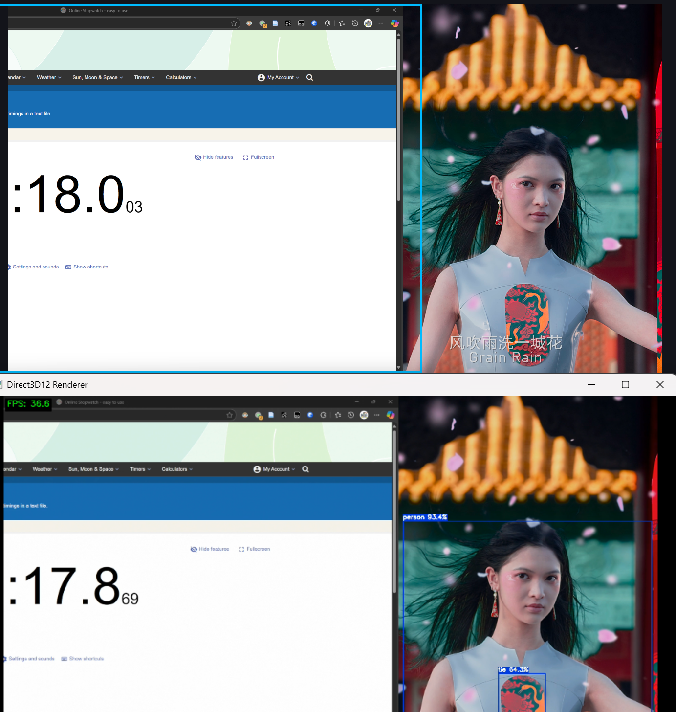

# GStreamer RKNN Plugin

A GStreamer plugin for object detection using Rockchip Neural Network (RKNN) on RK3588 platforms. This plugin currently only support YOLOv5.


## Performance

With frame-skip=0 (inference on every frame):
- 3840x2160: 19 fps
- 1920x1080: 30 fps, latency ~150 ms
    


With frame-skip=2 (inference on every 3rd frame):
- 3840x2160: 30 fps

## Prerequisites

- GStreamer 1.19 or higher

## Installation

### Building from Source

```bash
# Clone the repository
git clone https://github.com/yourusername/gstreamer-rknn.git
cd gstreamer-rknn

# Configure and build with meson
meson build
cd build
ninja
ninja install
```

## Usage

### Element Properties

The `rknn` element supports the following properties:

- `silent`: Suppress log messages (boolean)
- `bypass`: Skip object detection processing (boolean)
- `model-path`: Path to the RKNN model file (string)
- `label-path`: Path to the labels file (string)
- `show-fps`: Display frames per second (boolean)
- `frame-skip`: Number of frames to skip between inferences (int)

### Example Pipeline

Basic HDMI input to UDP streaming with object detection:

```bash
gst-launch-1.0 -v \
  v4l2src device=/dev/video0 io-mode=mmap do-timestamp=true \
  ! video/x-raw,format=NV16,width=1920,height=1080 \
  ! queue max-size-buffers=2 leaky=downstream \
  ! rknn silent=false bypass=false show-fps=true frame-skip=0 \
      model-path=/path/to/yolov5s-640-640.rknn \
      label-path=/path/to/coco_80_labels_list.txt \
  ! mpph264enc rc-mode=cbr bps=10000000 gop=30 \
  ! h264parse \
  ! rtph264pay pt=96 \
  ! udpsink host=192.168.1.100 port=5000
```

### Example Scripts

The repository includes example scripts for different scenarios:

- `script/stream_test.sh`: Basic streaming with RKNN inference
- `script/udp_test.sh`: Streaming to UDP endpoint with object detection
- `script/file_test.sh`: Recording video to file

## Limitations and Known Issues

1. **Model Support**: Currently only support YOLOv5 models. Other model architectures may require code modifications.

2. **Platform Dependency**: Only tested and optimized for RK3588 platforms. May not work on other Rockchip SoCs.


## References

- [RKNN YOLOv5 Demo](https://github.com/airockchip/rknn-toolkit2/tree/master/rknpu2/examples/rknn_yolov5_demo)
- [Rockchip librga](https://github.com/airockchip/librga)
